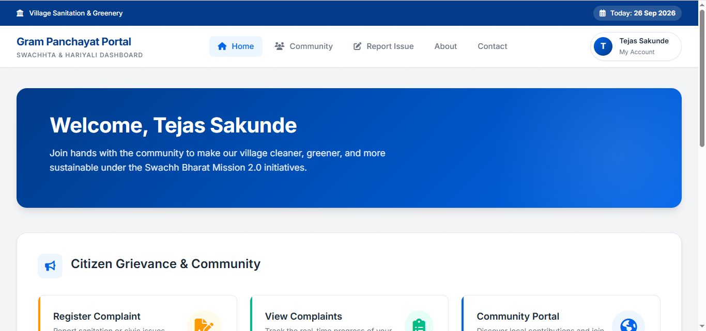
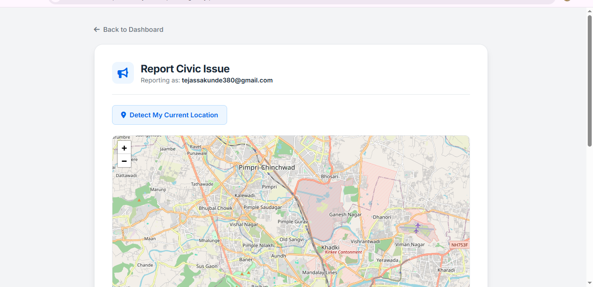
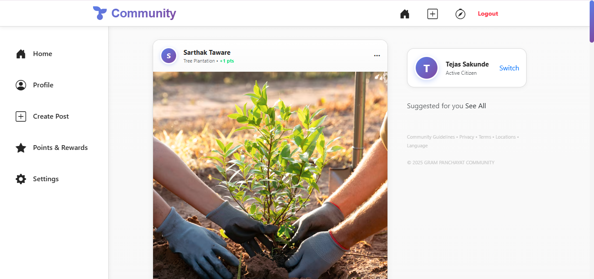
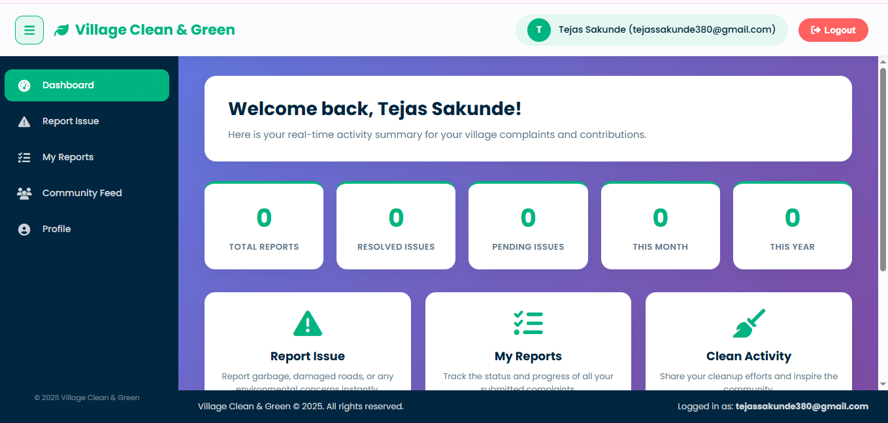

# Smart Environmental Infrastructure Reporting System

A web-based platform that makes it easier for citizens to report environmental and public infrastructure problems, and for authorities to review, prioritize, assign, and resolve those reports.

Citizens can report issues such as potholes, damaged roads, garbage, waterlogging, drainage problems, pollution, illegal dumping, dirty lakes, and empty land, with a photo, description, and GPS location. The platform also includes a community section where citizens can share activities like tree plantation and cleanliness drives.

---

## Table of Contents

- [About the Project](#about-the-project)
- [How It Works](#how-it-works)
- [Problem Statement](#problem-statement)
- [Proposed Solution](#proposed-solution)
- [Main Features](#main-features)
- [Complaint Status and Progress Tracking](#complaint-status-and-progress-tracking)
- [Priority Management](#priority-management)
- [Map and Location](#map-and-location)
- [Offline Mode](#offline-mode)
- [Community](#community)
- [Civic Services](#civic-services)
- [Technology Used](#technology-used)
- [Application Pages](#application-pages)
- [Screenshots](#screenshots)
- [Project Architecture](#project-architecture)
- [Project Structure](#project-structure)
- [Getting Started](#getting-started)
- [Security](#security)
- [Future Enhancements](#future-enhancements)
- [Real-World Applications](#real-world-applications)
- [Project Objectives](#project-objectives)
- [License](#license)

---

## About the Project

In many local areas, people face problems related to roads, garbage, drainage, waterlogging, pollution, and public infrastructure. Reporting these problems and keeping track of what happens after a complaint is submitted can be difficult.

This project brings the reporting and management process into one platform. A citizen submits a problem with its details and location. An administrator then reviews the report, categorizes it, sets its priority, assigns it to the appropriate department, and updates its status.

The basic workflow:

```
Report Issue
     ↓
Add Location & Evidence
     ↓
Categorize Issue
     ↓
Set Priority
     ↓
Assign Department
     ↓
Resolve Issue
     ↓
Verify
     ↓
Analyze
```

---

## How It Works

- When a villager or driver sees a damaged road, garbage, a dirty lake, or empty land, they open the app and take a photo of the issue.
- The app records the exact location using GPS and sends the report to the municipal (government) office.
- On the dashboard, officials see all complaints (roads, trash, lakes, rivers, water pools) with photos and locations.
- Officials decide which areas need attention first, based on how many people have reported the same issue.
- Users can also report and track activities such as cleaning public areas or planting trees in empty spaces.
- After planting a tree or cleaning a place, users upload photos and share their contribution with others on the app.
- These posts are shown publicly, so everyone in the village can see and appreciate the good work. It works like a LinkedIn-style community that motivates others to help.
- The system helps the municipal office keep roads, lakes, and rivers clean, and encourages citizens to make their village green, clean, and smart. 🌱

---

## Problem Statement

Common problems faced in local areas include:

- Potholes and damaged roads
- Garbage accumulation
- Illegal dumping
- Waterlogging
- Drainage problems
- Dirty or stagnant water
- Pollution
- Damaged public infrastructure
- Unmaintained or empty land

In a traditional complaint system, it is difficult to provide proper evidence, identify the exact location of a problem, track the complaint, and understand which problems need more attention. This project brings these activities together in a single system.

---

## Proposed Solution

The system provides separate functionality for citizens and administrators.

### Citizen

A citizen can:

- Create an account and log in
- Report an environmental or infrastructure issue
- Add a description
- Upload photos or videos
- Provide the location of the issue
- Use automatic GPS location detection
- View submitted reports
- Check complaint details
- Track the status and progress of a complaint
- Participate in community activities
- Share environmental improvement activities
- Manage their profile and earn contribution badges

### Administrator

An administrator can:

- Log in through the admin panel
- View submitted complaints
- Check complaint details and evidence
- Filter complaints by type, status, and priority
- Categorize complaints
- Set complaint priority
- Assign complaints to departments
- Update complaint status
- Monitor complaints using a map and heatmap
- Manage users (block or remove)
- View complaint statistics and top issues
- Manage community contributions

---

## Main Features

### Citizen Side

- Registration and Login
- Home page with quick actions: Report Issue, My Reports, Clean Activity, Tree Plantation
- Report an Issue with photo upload, automatic GPS location, and issue type
- Map-Based Reporting
- My Reports with status, progress bar, and admin responses
- Tree Plantation / Cleanup Activity with photo upload and location
- Community Feed: a LinkedIn-style feed of public contributions
- User Profile with user info, edit option, and badges for contributions

### Admin Side

- Admin Login
- Admin Dashboard with complaint statistics, heatmap, and top issues
- All Complaints with filters by type, status, and priority
- Complaint Details showing the image and GPS location, with options to assign priority and update status
- Heatmap Page for location-based monitoring
- Manage Users: block or remove users
- Community Contributions: view planted trees and cleanup activities

---

## Complaint Status and Progress Tracking

A complaint normally moves through these stages:

```
Pending → In Progress → Resolved
```

When an issue is resolved, the system can store:

- Responsible department
- Resolution description
- Resolution date and time
- Supporting images

Citizens can follow the progress of their complaint from submission to resolution, including admin responses, on the My Reports page.

---

## Priority Management

Priority can be assigned automatically based on the issue type, and admins can adjust it.

| Priority | Meaning                              | Examples                                 |
|----------|--------------------------------------|------------------------------------------|
| Critical | Serious or safety-related issue      | Accident-prone locations                 |
| High     | Important issue requiring attention  | Water leakage, road blockage             |
| Medium   | Normal civic or infrastructure issue | Garbage, drainage issues                 |
| Low      | Lower-severity issue                 | Dirty lakes, tree plantation suggestions |

Priority also depends on public safety, the number of people affected, location, and how many repeated complaints exist for the same issue. This helps municipal staff take action faster.

---

## Map and Location

Location is an important part of the reporting process. The system uses maps to:

- Select the location of an issue
- Capture the current location automatically
- Display reported issues
- View nearby problems
- Monitor issues based on location
- Identify areas where multiple problems have been reported

**Map technology:** the project uses [OpenStreetMap](https://www.openstreetmap.org/) with [Leaflet](https://leafletjs.com/).

### Public Issue Map (Heatmap)

A heatmap shows:

- Areas with the most complaints
- **Red zones:** urgent issues
- **Green zones:** clean areas

This helps officials plan resources properly.

---

## Offline Mode

For rural areas with weak network coverage:

- Users can take photos and prepare reports offline
- Reports upload automatically when the internet is available

---

## Community

The project is not limited to complaint reporting. It also encourages citizens to take part in improving their surroundings. The community section supports:

- Tree plantation
- Cleanliness drives
- Environmental awareness
- Community activities
- Sharing environmental improvement posts with photos

Contributions are shown publicly in the Community Feed, so everyone can see and appreciate the good work. Users earn badges for their contributions.

---

## Civic Services

The project includes a concept for Civic Services, where citizens can apply for services and track their applications. Possible services include:

- Birth certificate
- Death certificate
- Marriage certificate
- Document submission
- Application tracking
- Application status

These services can be expanded according to the requirements of the organization using the system.

---

## Technology Used

| Category     | Technology                      |
|--------------|---------------------------------|
| Frontend     | HTML, CSS, Bootstrap, AJAX, JSP |
| Backend      | Java, Java Servlets             |
| Architecture | MVC                             |
| Database     | MySQL                           |
| Server       | Apache Tomcat                   |
| IDE          | Eclipse                         |
| Maps         | OpenStreetMap (Leaflet)         |

---

## Application Pages

The website has **15 pages** in total.

### Citizen Side (8 pages)

1. Login
2. Signup
3. Home
4. Report Issue
5. My Reports
6. Tree Plantation / Cleanup Activity
7. Community Feed
8. Profile

### Municipal / Admin Side (7 pages)

9. Admin Login
10. Admin Dashboard
11. All Complaints
12. Complaint Details
13. Heatmap
14. Manage Users
15. Community Contributions

---

## Screenshots

### Homepage


### Report Civic Issue


### Community


### Citizen Dashboard


---

## Project Architecture

The application follows the MVC architecture using Java Servlets.

```
             User
               |
               v
        JSP / HTML / CSS
        Bootstrap / AJAX
               |
               v
         Java Servlets
               |
               v
           MVC Layer
               |
               v
             MySQL


       Map / Location
               |
               v
      Leaflet + OpenStreetMap
```

---

## Project Structure

```
environment-infrastructure-reporting/
│
├── Main/
├── react-project/
├── screenshots/
└── LICENSE
```

- `Main/` contains the Java Servlets/JSP web application (Eclipse project).
- `react-project/` contains the React frontend.
- `screenshots/` contains the images used in this README.

> The structure may change as the project continues to be developed.

---

## Getting Started

### Requirements

- Java JDK
- Eclipse IDE
- Apache Tomcat
- MySQL Server
- MySQL Connector/J
- Git

### Clone the Repository

```bash
git clone https://github.com/tejassakunde709-code/environment-infrastructure-reporting.git
cd environment-infrastructure-reporting
```

### Import into Eclipse

1. Open Eclipse.
2. Go to **File → Import → General → Existing Projects into Workspace**.
3. Browse to the `Main/` folder inside the cloned repository and import the project from there.

### Configure Tomcat

1. In Eclipse, go to **Window → Preferences → Server → Runtime Environments**.
2. Add your Apache Tomcat installation.
3. Configure the project to use it.

### Configure MySQL

Create the database:

```sql
CREATE DATABASE smart_environmental_system;
```

Then create the required tables using the SQL scripts included in the project, if available.

### Database Connection

The application uses a MySQL connection similar to:

```java
String url = "jdbc:mysql://localhost:3306/smart_environmental_system";
String username = "root";
String password = "YOUR_MYSQL_PASSWORD";
```

Replace `YOUR_MYSQL_PASSWORD` with your local MySQL password.

> **Do not add your actual password to GitHub.**

### Run the Project

1. Right-click the project in Eclipse.
2. Select **Run As → Run on Server**.
3. Choose **Apache Tomcat** and click **Start**.
4. Once Tomcat starts, open the application in your browser.

---

## Security

Sensitive information should not be stored in the GitHub repository. Do not commit:

- Database passwords
- API keys
- Authentication tokens
- Private credentials

For local development, use local configuration files or environment variables.

---

## Future Enhancements

### AI / Machine Learning

- Automatic pothole detection from images
- Duplicate complaint detection
- Problem hotspot detection
- Environmental trend analysis
- Spam or invalid report detection

---

## Real-World Applications

The system can be adapted for use by:

- Gram Panchayats
- Municipal Councils
- Municipal Corporations
- Local government authorities
- Environmental departments
- Smart City projects

It can be used for reporting civic problems, tracking complaints, coordinating departments, and understanding recurring problems in local areas.

---

## Project Objectives

1. Make it easier for citizens to report local problems.
2. Allow citizens to provide photos, videos, descriptions, and locations.
3. Help authorities organize and manage complaints.
4. Make it easier to prioritize important issues.
5. Assign complaints to the appropriate department.
6. Allow citizens to track complaint progress.
7. Support map-based monitoring.
8. Encourage community participation.
9. Provide useful complaint information for administrators.
10. Provide a foundation for future AI-based improvements.

---

## License

This project is licensed under the [MIT License](LICENSE).

Copyright (c) 2026 VPKBIET – Computer Engineering Project Team
